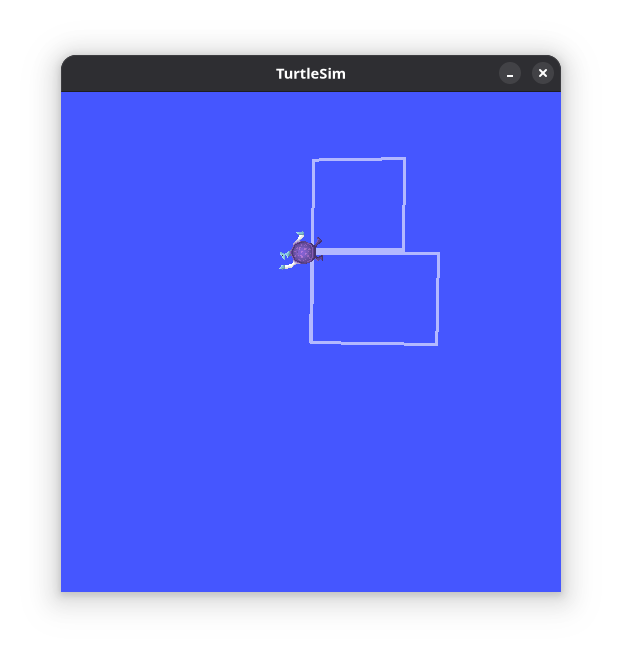

# Задание ex00 — Проверка установки ROS2

## Выполненные шаги
- [x] `turtlesim_node` запускается без ошибок
- [x] `turtle_teleop_key` работает корректно
- [x] Черепаха реагирует на управление через клавиши
- [x] Нарисована траектория в виде первой буквы логина (B)
- [x] Файл `screenshot.png` сохранён в папке `ex00/`

## Результат

